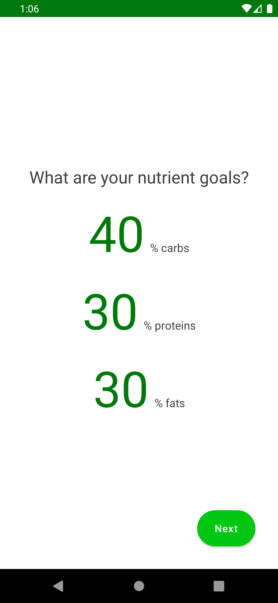
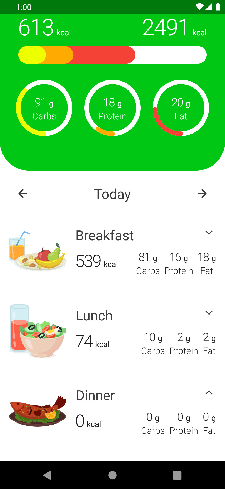
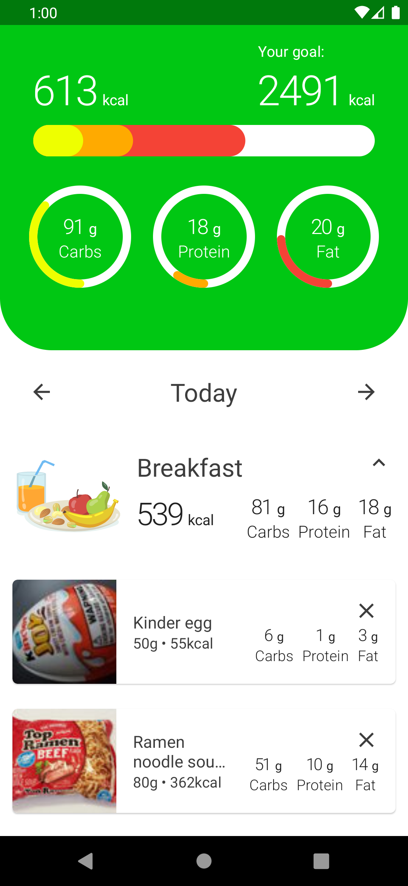
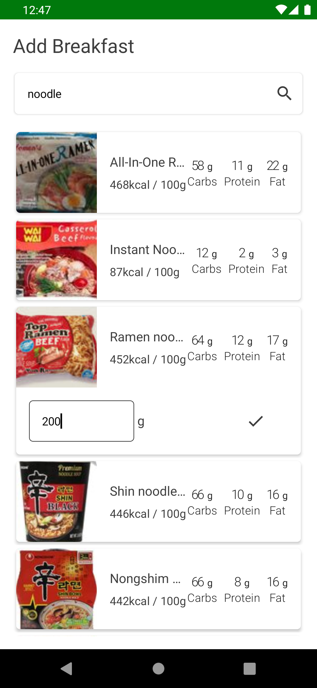
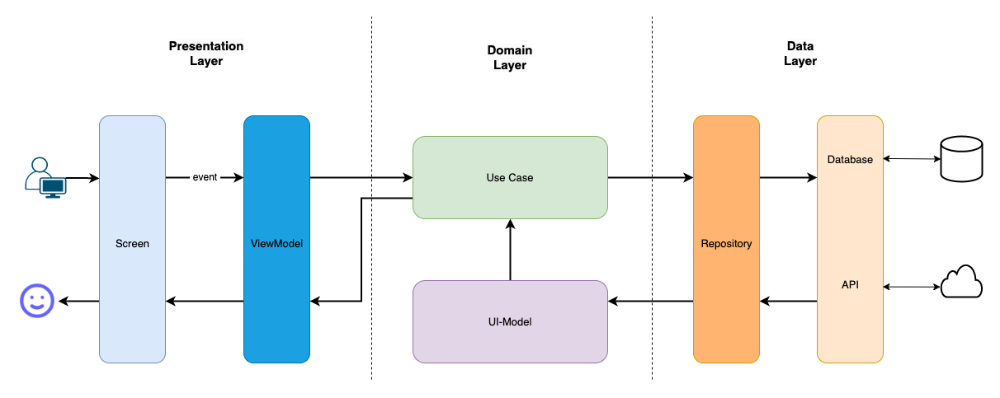
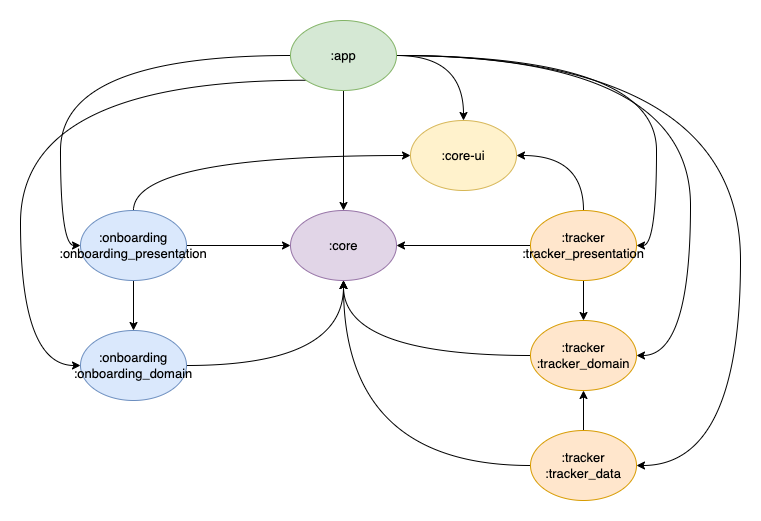

<h1 align="center">CalorieTracker</h1> 

  
A calorie tracker app based on Philipp Lackner's <a href="https://pl-coding.com/multi-module-course"> multi module course</a>. With this app you can search for any type of food you desire, whether it's breakfast, lunch, dinner or a snack. Once you have found the food you want, you can add it to your meal section, which helps you keep track of what you're eating throughout the day. You can find the detailed tech stack and architecture in the below sections. The purpose is to learn how to structure different modules with Clean Architecture.

After completing the course I made the following changes/improvements:
  - Replaced [Compose Navigation](https://developer.android.com/jetpack/compose/navigation) with [Compose Destinations](https://github.com/raamcosta/compose-destinations)
  - Inceased test cases
  - Added [Detekt](https://github.com/detekt/detekt) for static code analysis

  
   

## Screeshots :camera_flash:

## Tech stack & Libraries :books:

- [Android Architecture Components](https://developer.android.com/topic/libraries/architecture) - Best practices for testable, maintainable and robust high-quality apps.
  - [Compose Destinations](https://github.com/raamcosta/compose-destinations) - Easy navigation library for compose (used with single activity)
  - [Lifecycle](https://developer.android.com/topic/libraries/architecture/lifecycle) - use viewmodel, a lifecycle aware component
  - [ViewModel](https://developer.android.com/topic/libraries/architecture/viewmodel) - Stores UI-related data and persists it through configuration changes. 
  - [UseCases](https://developer.android.com/topic/architecture/domain-layer)  
    - Contains business logic with a single responsibility. 
    - Located in domain layer that sits between the UI layer and the data layer. 
  - [Repository](https://developer.android.com/topic/architecture/data-layer) - Located in data layer that contains application data and business logic.
- [Jetpack Compose](https://developer.android.com/jetpack/compose) - is the modern toolkit recommended by Android for building native user UI. It streamlines and speeds up the development process by allowing for the creation of powerful and intuitive UI with less code and easy-to-use Kotlin APIs.
- [Android Hilt](https://developer.android.com/training/dependency-injection/hilt-android) - Dependency Injection Library for Android
- [Coroutines](https://developer.android.com/kotlin/coroutines) - is a concurrency design pattern that you can use on Android to simplify code that executes asynchronously.
- [Flow](https://developer.android.com/kotlin/flow) - is a type that can emit multiple values sequentially. They are built on top of coroutines and can provide multiple values.
  - [Channels](https://kotlinlang.org/docs/channels.html) - are a good fit for communication between different coroutines, or any use case that requires a producer-consumer approach.
- [Room](https://developer.android.com/training/data-storage/room) - Persisten library for Android
- [Retrofit](https://square.github.io/retrofit/) - simplifies network requests and responses by providing a high-level REST client implementation.
  - [OkHttp](https://square.github.io/okhttp/) - is the backbone library of Retrofit for sending and receive HTTP-based network requests.
  - [Moshi](https://github.com/square/moshi) - is for parsing JSON into Kotlin.
- [Coil Compose](https://coil-kt.github.io/coil/compose/) - is a library for loading images on Android, utilizing Kotlin Coroutines for efficient and responsive performance.
- [Detekt](https://github.com/detekt/detekt) - Static code analysis for Kotlin
- [Timber](https://github.com/JakeWharton/timber) - Logging library for Android
- Testing
  - [Truth](https://truth.dev) - Fluent assertions for Android
  - [Mockk](https://github.com/mockk/mockk) - Mocking library
  - [MockWebServer](https://github.com/square/okhttp/tree/master/mockwebserver) - A scriptable web server for testing HTTP clients
  - [Turbine](https://github.com/cashapp/turbine) - A small testing library for kotlinx.coroutines Flow

## Architecture :straight_ruler:

The app is built using ***MVVM (Model-View-ViewModel)*** architecture with Presentation, Domain and Data layers.

## Dependency Graph

The graph below illustrates the relationships between different modules by indicating which modules include other modules.

